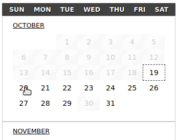

# Datepicker Plus




*Datepicker Plus* is an input control to select dates. It's a **web component** built with [StencilJS](https://stenciljs.com/). *Datepicker Plus* can be used directly in a web page or you can integrate the *Datepicker* with other frameworks, like angular, react or Vue. check [stenciljs framework integration](<https://stenciljs.com/docs/overview>) for more info.

**Features**

- supports single, multiple and range select mode
- flexible view range
- dynamic date attributes
- fully customizable
- supports select constraints
- i18n support
- ability to integrate with other frameworks

**Documentation**

- [Installation](#installation)
- [Integration](#integration)
- [Configuration](#configuration)
- [Events](#events)
- [Custom Styles](#custom-styles)
- [Development](#development)

---

### <a name="installation">Installation</a>

```shell
npm i @bitbite/datepicker-plus --save
```

---

### <a name="integration">Integration</a>

- *Integration details can be found at* [StencilJS Integration Docs.](<https://stenciljs.com/docs/overview>)

---


### <a name="configuration">Configuration</a>

- *Datepicker Plus takes a single config. Object as a prop. check below:*

``` typescript
/**
 * datepicker web component configuration
 *
 * The standard date format for datepicker config.
 * is the DateString. DateString is a formatted string
 * that can be converted to a Javascript Date Object.
 * 
 * example dateString:
 * 2019-10-19 (YYYY-MM-dd)
 */
export interface IPlusConfig {
    /**
     * Optionally set select mode to one of the available
     * select modes listed below:
     * 
     * 'single'   - select a single date 
     * 'multiple' - select multiple distinct dates
     * 'range'    - select a range between two dates (default)
     */
    selectMode?: SelectMode
    
    /**
     * Optionally set the view range given the pair
     * (start date string, end date string).
     * 
     * if not provided, the current month will be
     * the default view range.
     */
    viewRange ?: [DateString, DateString]
  
    /**
     * Optionally provide one 'dateString', date attribute
     * or more to be selected on init.
     */
    selected  ?: DateString[]
  
    /**
     * Optionally provide one 'dateString', date attribute
     * to be disabled on init.
     */
    disabled  ?: DateString[]
  
    /**
     * Optionally select week header mode.
     * 
     * there are two modes available:
     * 'single'     - a single header for all months
     * 'per-month'  - each month has his own header (default)
     */
    weekHeader?: WeekHeader
  
    /**
     * Optionally set a scope size. if present
     * a scope size larger than 0. on date select
     * the user will be limited to choose from within
     * the scope.
     * 
     * for example, give the configuration below.
     * { selectScopeSize: 7 }
     * 
     * The user can select up to 7 dates
     * [-6][-5][-4][-3][-2][-1][ <-*-> ][1][2][3][4][5][6]
     */
    selectScopeSize?: number
  
    /**
     * Optionally provide a custom style sheet url to be
     * loaded and injected inside the datepicker component.
     */
    stylesheetUrl ?: string
  
    /**
     * optionally provide a localized content
     * for datepicker.
     */
    i18n?: {
      /**
       * (default)
       *  1 Sunday     (Sun)
       *  2 Monday     (Mon)
       *  3 Tuesday    (Tue)
       *  4 Wednesday  (Wed)
       *  5 Thursday   (Thu)
       *  6 Friday     (Fri)
       *  7 Saturday   (Sat)
       */
      weekDays?: IWeekDay[]
      /**
       * (default)
       *  01 January        (Jan)
       *  02 February       (Feb)
       *  03 March          (Mar)
       *  04 April          (Apr)
       *  05 May            (May)
       *  06 June           (Jun)
       *  07 July           (Jul)
       *  08 August         (Aug)
       *  09 September      (Sep)
       *  10 October        (Oct)
       *  11 November       (Nov)
       *  12 December       (Dec)
       */
      months?: IMonth[]
    }
    
    /**
     * Optionally select datepicker layout
     * 'vertical' (default)
     */
    layout?: 'vertical' | 'horizontal'
  }
```


### <a name="events">Events</a>

 `onDateSelect`

- emits when a date is selected. use it to react to a date selected.

-  emitted *`CustomEvent<string[]>`*

---

`onDeselect` 

- emits when a date is deselected use it to react to date deselected

- emitted  *`CustomEvent<string[]>`*

---

`onHighlight` 

- emits when a date or more is highlighted as potential select candidate 

- emitted  *`CustomEvent<string[]>`*

---

`onHighlight` 

- emits when a date or more is highlighted as potential select candidate 

- emitted  *`CustomEvent<string[]>`*

---

`onHighlightClear` 

- emits when date highlight is cleared after dates deselect 

- emitted  *`CustomEvent<void>`*

---

`onRangeSelect` 

- emits when a complete date range is selected use it to react to a complete date range selected

- emitted  *`CustomEvent<string[]>`*

---

### <a name="custom-styles">Custom Styling</a>

Applying custom styles to *Datepicker plus* is as easy as passing a *stylesheet url* as a prop. to the config. Object. You can as well use web component stylable parts to style the datepicker.

```javascript
{
   stylesheetUrl ?: string // stylesheet url
}
```

| selector       | description                                               |
| -------------- | --------------------------------------------------------- |
| .dpp-custom | targets datepicker plus container |
| .day           | targets every datepicker day control                      |
| .year          | targets date controls in a year                           |
| .disabled      | targets disabled date controls                            |
| .checked       | targets selected date controls                            |
| .month         | targets month container                                   |
| .month-name    | targets month name                                        |
| .month-header  | targets month header                                      |
| .month-content | targets month controls container                          |
| .week          | targets week container                                    |
| .empty         | targets empty slots                                       |
| .week-header   | targets week header                                       |
| .week-header > abbr | targets week header abbreviation |
| .week-content  | targets week controls container                           |
| .weekend       | targets weekend header                                    |
| .checkbox      | targets hidden checkbox controls                          |
| .single-header | if header mode is single you can override this class      |
| .highlight     | targets highlighted controls                              |
| .connector     | targets selected date controls between two selected dates |
| .rangeStart    | targets selected range start date controls                |
| .rangeEnd      | targets selected range end date controls                  |

*Dynamic attributes* will reflect it's class to every control that has an attribute enabled. This attributes can be styled as well. **( .today - .tomorrow - .yesterday - .past - .future )**

*Web Component parts styling is also available:*

```css
datepicker-plus::part(dpp-container) { ... }
datepicker-plus::part(month-header) { ... }
datepicker-plus::part(month) { ... }
datepicker-plus::part(week-header) { ... }
datepicker-plus::part(week) { ... }
datepicker-plus::part(day) { ... }
```


---

#### <a name="development">Development</a> 

#### ![Built With Stencil](https://img.shields.io/badge/-Built%20With%20Stencil-16161d.svg?logo=data%3Aimage%2Fsvg%2Bxml%3Bbase64%2CPD94bWwgdmVyc2lvbj0iMS4wIiBlbmNvZGluZz0idXRmLTgiPz4KPCEtLSBHZW5lcmF0b3I6IEFkb2JlIElsbHVzdHJhdG9yIDE5LjIuMSwgU1ZHIEV4cG9ydCBQbHVnLUluIC4gU1ZHIFZlcnNpb246IDYuMDAgQnVpbGQgMCkgIC0tPgo8c3ZnIHZlcnNpb249IjEuMSIgaWQ9IkxheWVyXzEiIHhtbG5zPSJodHRwOi8vd3d3LnczLm9yZy8yMDAwL3N2ZyIgeG1sbnM6eGxpbms9Imh0dHA6Ly93d3cudzMub3JnLzE5OTkveGxpbmsiIHg9IjBweCIgeT0iMHB4IgoJIHZpZXdCb3g9IjAgMCA1MTIgNTEyIiBzdHlsZT0iZW5hYmxlLWJhY2tncm91bmQ6bmV3IDAgMCA1MTIgNTEyOyIgeG1sOnNwYWNlPSJwcmVzZXJ2ZSI%2BCjxzdHlsZSB0eXBlPSJ0ZXh0L2NzcyI%2BCgkuc3Qwe2ZpbGw6I0ZGRkZGRjt9Cjwvc3R5bGU%2BCjxwYXRoIGNsYXNzPSJzdDAiIGQ9Ik00MjQuNywzNzMuOWMwLDM3LjYtNTUuMSw2OC42LTkyLjcsNjguNkgxODAuNGMtMzcuOSwwLTkyLjctMzAuNy05Mi43LTY4LjZ2LTMuNmgzMzYuOVYzNzMuOXoiLz4KPHBhdGggY2xhc3M9InN0MCIgZD0iTTQyNC43LDI5Mi4xSDE4MC40Yy0zNy42LDAtOTIuNy0zMS05Mi43LTY4LjZ2LTMuNkgzMzJjMzcuNiwwLDkyLjcsMzEsOTIuNyw2OC42VjI5Mi4xeiIvPgo8cGF0aCBjbGFzcz0ic3QwIiBkPSJNNDI0LjcsMTQxLjdIODcuN3YtMy42YzAtMzcuNiw1NC44LTY4LjYsOTIuNy02OC42SDMzMmMzNy45LDAsOTIuNywzMC43LDkyLjcsNjguNlYxNDEuN3oiLz4KPC9zdmc%2BCg%3D%3D&colorA=16161d&style=flat-square)

---

## Getting Started

- install dependencies

```bash
npm install
```

- start development server

```bash
npm start
```

To build the component for production, run:

```bash
npm run build
```

To run the unit tests for the components, run:

```bash
npm test
```

Need help? Check out stencilJS docs [here](https://stenciljs.com/docs/my-first-component).
